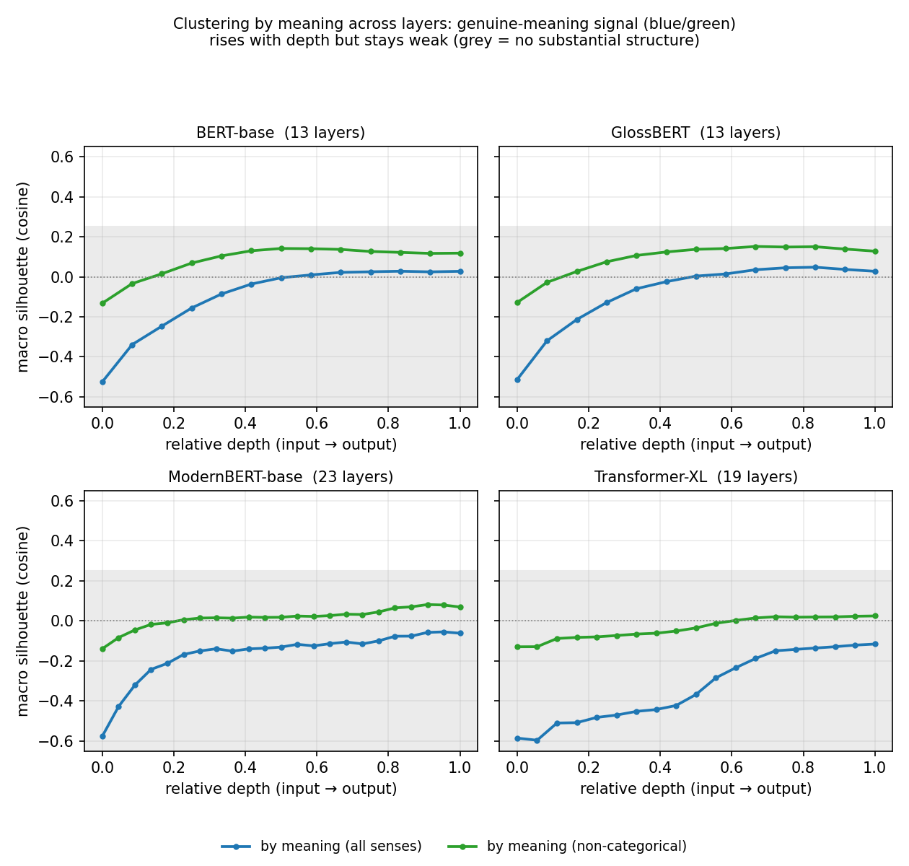

# Neural embeddings half — IMM 2026

> Markdown source for the second half of *"Context effects of form and meaning in
> overabundant English verbs: manual semantic tagging vs. neural language model
> embeddings"* (Parker & Reynolds). Each `---` is a slide break. Indented
> `Notes:` blocks are speaker notes, not slide text. Designed to follow Jeff's
> "Methods pt. 3" placeholder and replace the embedding-side slides (his slides
> ~129–182) through the joint conclusions.

---

## From manual tags to neural embeddings: the same question, a different lens

- Jeff's manual tagging asks: **when speakers choose a form, does *meaning* condition the choice?**
- The neural half asks the mirror-image question:
  - If two overabundant forms differ in meaning, that difference should live in **context**.
  - Modern language models are trained to encode exactly that context.
  - So: **can a transformer "see" the form–meaning distinctions we tagged by hand — without being told they exist?**
- This is a direct test of the **distributional hypothesis** (Harris 1954; Firth 1957: *"You shall know a word by the company it keeps"*) applied to overabundance.

> Notes: Frame this as complementary, not competing. Manual tagging = top-down,
> theory-driven, expensive, high-precision. Embeddings = bottom-up, automatic,
> cheap, but a black box. The interesting science is where they agree and
> disagree.

---

## Why we expected this to work

- Contextual embeddings (BERT and successors) are known to encode **word sense**: occurrences of a polysemous word in different senses occupy different regions of the space (Wiedemann et al. 2019; Reif et al. 2019; Coenen et al. 2019).
- They carry **morphological** information (Edmiston 2020; Hofmann et al. 2020).
- Layers specialize: lower = surface/lexical, middle = syntax, upper = semantics (Tenney et al. 2019, *"BERT rediscovers the classical NLP pipeline"*; Jawahar et al. 2019; Rogers et al. 2020).
- **Prediction:** if *strove* vs. *strived* (or *hanged* vs. *hung*) carry distinct meanings, sense-conditioned context should pull their embeddings apart — and the strength of separation should track Jeff's distributional significance.

> Notes: Set up the expectation honestly so the negative result lands as
> informative rather than as a failure. We had good theoretical reasons to
> expect separation.

---

## Methods pt. 3: models

We embedded the **same 75 overabundant pairs** (100+ tokens per form) in five transformers spanning architectures, sizes, and training objectives:

| Model | Type | Why included |
|---|---|---|
| **BERT-base** (Devlin et al. 2019) | Masked LM, 12 layers | Field-standard baseline |
| **ModernBERT-base** (Warner et al. 2024) | Masked LM, 22 layers | State-of-the-art encoder |
| **GlossBERT** (Huang et al. 2019) | Sense-supervised BERT | *Tuned for word-sense disambiguation* |
| **Transformer-XL** (Dai et al. 2019) | Autoregressive | Long-context, different objective |
| **Qwen2.5-32B** (Qwen Team 2024) | Decoder LLM, 64 layers | Tests whether *scale* rescues the task |

> Notes: GlossBERT and Qwen are the two "if anything can do it, these can"
> controls — a model explicitly trained on senses, and a 32B-parameter LLM.

---

## Methods pt. 3: the embedding design

- For each attested token, take the model's **contextual embedding of the target word** in its real sentence — the `orig` embedding.
- Construct a **minimal pair**: swap in the competing form, re-embed → the `artificial` embedding.
  - *"I've **ate** the biscuits"* → *"I've **eaten** the biscuits"*
- **`delta` = orig − artificial**: isolates *what changes when only the form changes*, holding context constant.
- This controls for topic/context confounds: a clean test of whether the model treats the two forms as **semantically distinct in identical contexts**.

> Notes: The delta design is our methodological contribution. If the model
> thought the forms meant different things, delta would be large and structured.
> Spoiler: delta mostly encodes *which form was swapped*, i.e. surface identity —
> see the layer slide.

---

## Methods pt. 3: how we measured "separation"

Four complementary, increasingly demanding tests:

1. **Visualization** — t-SNE / UMAP / PCA in 2D & 3D, per lexeme.
2. **Supervised separability** — leave-one-out nearest-centroid accuracy: *given the labels, can we tell the senses/forms apart?*
3. **Bottom-up clustering** — k-means + **silhouette score** (−1 to 1): *does structure emerge with no labels?*
   - >0.50 reasonable · 0.25–0.50 weak/possibly artificial · <0.25 none.
4. **Model-internal** — silhouette at **every layer**; **elbow method** for the natural number of clusters per lexeme.

> Notes: Silhouette thresholds are Jeff's slide already (Rousseeuw 1987;
> Kaufman & Rousseeuw 1990). The four tests let us separate "can't do it at all"
> from "can do it only when spoon-fed the answer."

---

## Result 1 — Bottom-up, the meaning structure does not emerge

Mean silhouette of **manually-tagged sense clusters**, clustering with *no* prior knowledge (`raw`, cosine):

| Model | Silhouette (raw senses) |
|---|---|
| ModernBERT | −0.06 |
| BERT-base | 0.03 |
| GlossBERT | 0.03 |
| Transformer-XL | −0.12 |
| Qwen-32B | ≈ 0 |

- **Every model is at or below zero** — no substantial structure (Rousseeuw 1987).
- Visually: e.g. *lit* vs. *lighted* — **no clustering by meaning** (cf. Jeff's slide).

> Notes: This is the headline negative result. Left to themselves, the
> embeddings do NOT recover the sense partition we built by hand. Even
> GlossBERT — trained on senses — sits at 0.03.

---

## Result 2 — It "works" only where form already gives away the meaning

Leave-one-out classification accuracy, by how meaning conditions form:

| Sense type | LOO accuracy | Silhouette |
|---|---|---|
| **Categorically** conditioned (form ≈ predictable from sense) | **0.88 – 0.94** | 0.16 – 0.49 |
| Non-categorical senses (form *not* predictable) | **0.49 – 0.75** (≈ chance) | ≈ 0.00 – 0.13 |

- High accuracy on categorical cases is **partly tautological**: where one sense (almost) always takes one form, telling senses apart ≈ telling *forms* apart.
- Remove the categorically-conditioned senses and **separability collapses to chance.**

> Notes: This is the crucial caveat against over-claiming. The model looks smart
> exactly where the task is easy (form and meaning confounded) and is at chance
> on the genuinely interesting probabilistic/variable cases — which is most of
> the data.

---

## Result 3 — Where does meaning live? Clustering by meaning, layer by layer

By-meaning silhouette (cosine, macro) at **every hidden layer** of each model. Grey band = "no substantial structure" (< 0.25).

- 🔴 **Form-predictable senses** (label tracks the *form*): **highest at the input layer (~0.50–0.58), fades with depth** → the surface-form cue is contextualized away.
- 🔵🟢 **Genuine meaning** (all senses / non-categorical): **negative at the input, *rises* with depth, but plateaus weak** (peak ≈ 0.03–0.15) — never escapes the grey band.

> Notes: This replaces the form-confounded metric we showed earlier. The two
> signals cross: as you go deeper, form-separability falls and meaning-
> separability rises — exactly the lexical→semantic progression of Tenney et al.
> (2019). The punchline: the models DO build meaning with depth, they just can't
> separate these closely-related overabundant senses strongly at any layer.

---

## Result 3 (cont.) — The same picture in numbers

Best (peak-layer) by-meaning silhouette, *orig* embeddings — and where it occurs:

| Model | Meaning, all senses | Meaning, non-categorical | Form-predictable (cat.) |
|---|---|---|---|
| BERT-base | 0.03 (deep) | 0.14 (mid) | 0.54 → **0.18** (input→final) |
| GlossBERT | 0.05 (deep) | 0.15 (upper) | 0.53 → **0.19** |
| ModernBERT | −0.06 (top) | 0.08 (top) | 0.58 → **0.26** |
| Transformer-XL | −0.12 (top) | 0.03 (top) | 0.59 → **0.16** |

- **No model, no layer** reaches "reasonable structure" (0.51) for genuine meaning; the best is GlossBERT's 0.15 — still "weak/possibly artificial."
- Form separability **collapses** from input to output (e.g. 0.58 → 0.26) as the variants are pulled toward a shared contextual representation.
- The **standard final-layer embedding** (the headline "orig" result) is the *rightmost* point on each curve — and for non-categorical meaning it isn't even the best layer (the mid/upper layers edge it out).

> Notes: GlossBERT (sense-trained) edges out the rest on meaning, but only
> trivially. Our per-layer final-layer values reproduce the headline numbers
> exactly (e.g. BERT cat-only 0.182), confirming the headline "orig" embedding is
> the full final-layer vector. The per-layer view shows *why* it's weak: form-
> info and meaning-info peak at different depths and neither yields strong meaning
> clusters. Qwen-32B per-layer run is pending (its cache stores only attention-
> head slices of the final layer, not hidden states) — see backup.

---

## Result 4 — Models radically *under-segment* meaning

- Manual tagging: **~9.5 senses per lexeme**; 171 senses with 15+ examples.
- **Elbow method** on the embeddings picks the "natural" number of clusters:
  - **k = 2 about 75% of the time**; median silhouette at the chosen k ≈ **0.22** (weak).
- Embeddings see a **coarse two-way split** (largely the two forms) where speakers and lexicographers see ~10 senses.

> Notes: The granularity mismatch is itself a finding. Whatever the models
> encode about these words, it is far coarser than lexical semantic structure —
> consistent with WSI literature that bottom-up sense induction tends to
> under-split.

---

## Result 5 — Aligning the two methods: weak, unstable correlation

Do embedding clustering metrics track Jeff's distributional significance (`p_eq` = "no preference" test; `p_cat` = categorical/Fisher test)?

- **Best overall association:** Spearman ρ ≈ **−0.27** (k=2/form variance ratio vs. `p_eq`) — weak.
- Best per-model slices reach |ρ| ≈ **0.4–0.49** (ModernBERT), **but**:
  - signs flip across models and embedding types;
  - Spearman and Pearson disagree (e.g. ρ = 0.45 with r = 0.75, or ρ = 0.37 with r ≈ 0).
- **Median k=2 silhouette by conditioning type:** no-cond **0.27** ≈ prob **0.26** > **cat 0.15**.
  - The categorically-conditioned senses — the ones with the *strongest* form–meaning link — cluster **worst**.

> Notes: There is no robust, model-independent signal that lines up with the
> manual distributional types. The one direction that is stable (cat clusters
> worst) is the wrong direction for the "embeddings recover meaning" story —
> again because deep representations neutralize the form distinction.

---

## Robustness — scale and hyperparameters don't rescue it

- **Dimensionality-reduction grid search** (t-SNE perplexity, UMAP n-neighbors/min-dist, PCA): visualizations shift cosmetically; **the clustering conclusions do not change.**
- **Model scale doesn't help:** on the headline (final-layer) clustering, Qwen-32B is no better than 110M-parameter BERT; its final-layer attention-head subspaces show the same flat, weak by-meaning signal.
- **Sense supervision doesn't help:** GlossBERT ≈ vanilla BERT.
- As Jeff's conclusion puts it: *"distinctions without a meaningful difference for our data."*

> Notes: Pre-empt the "you used the wrong model/parameters" question. We swept
> them. The result is robust to architecture, scale, training objective, and
> reduction method.

---

## Why are the embeddings so quiet here?

1. **The distinctions are genuinely subtle or absent.** For many pairs there may be *no* meaning difference to find (Jeff: *strive/strove*, *had striven/had strived*) — the models' silence is *correct*.
2. **Geometry fights us.** Contextual spaces are highly **anisotropic** and dominated by a few "rogue" dimensions, which inflate similarity and crush fine distinctions in cosine/silhouette terms (Ethayarajh 2019; Timkey & van Schijndel 2021; Mu & Viswanath 2018).
3. **Granularity & sparsity.** ~10 senses per lexeme, ~100 tokens per form, past participles only ~14% of tokens — thin data for fine sense geometry.
4. **Meaning ≠ the only conditioning.** Register, dialect, and social evaluation (Jeff's other axis) are not what these sentence-level embeddings foreground.

> Notes: Point 1 is the charitable and probably-true reading for much of the
> data. Points 2–4 are the methodological cautions for anyone who wants to try
> this. Anisotropy is the single most important technical caveat — naive cosine
> silhouette *understates* whatever signal is present.

---

## What transformer embeddings CAN do here (strengths)

- **Confirm the easy cases automatically.** Where meaning categorically conditions form (e.g. *hanged* vs. *hung*), supervised separation is high (LOO 0.88–0.94) and clusters are visible — a cheap automatic detector for *clear* conditioning.
- **Corroborate "no difference" findings.** With depth the variants' surface-form separability collapses toward a shared representation — independent evidence that pairs like *strive/strove* are functionally interchangeable.
- **Scale.** Once set up, the pipeline runs over hundreds of lexemes with no annotation — a useful **triage / hypothesis-generation** tool to flag pairs worth manual tagging.
- **The delta + per-layer design** gives an interpretable read on *where* (if anywhere) a distinction is encoded.

---

## What they CANNOT do here (weaknesses)

- **No reliable bottom-up sense discovery** for closely-related, in-paradigm variants (raw by-meaning silhouette ≈ 0 at every layer of every model tested).
- **Cannot recover the number of senses** — they under-segment (~k=2 vs. ~9.5).
- **No stable mapping** onto the distributional significance types (correlations weak, signs unstable).
- **Confound trap:** apparent success often reflects **surface form**, not meaning — visible only because we did the per-layer and form-removed controls.
- **Scale and sense-supervision do not close the gap.**

> Notes: The honest one-liner for the abstract: *current transformer embeddings
> are good at confirming distinctions you already suspect, and poor at
> discovering subtle in-paradigm form–meaning distinctions on their own.*

---

## Bringing the two halves together

- Manual tagging and embeddings **converge** on the big picture: many overabundant pairs show **little or no semantic conditioning**, and where they do, it is often **probabilistic**, not categorical.
- They are **complementary, not interchangeable**:
  - Manual tags = ground truth, fine-grained, needed to *interpret* the embedding space.
  - Embeddings = scalable triage, and a check on whether a hypothesized distinction is "really there."
- **Best practice:** use manual tags to *zoom in* — give the model the senses and ask *where* it separates them — rather than asking it to find them blind.

> Notes: This is the methodological payoff and matches Jeff's conclusion line
> "using manual tags to zoom in with embeddings can be useful." Sell the hybrid
> workflow.

---

## Future research

- **De-bias the geometry first:** standardize/whiten embeddings, remove rogue dimensions, use Mahalanobis or learned metrics before clustering (Timkey & van Schijndel 2021; Mu & Viswanath 2018).
- **Probing instead of clustering:** train light supervised probes (Hewitt & Manning 2019; Belinkov 2022) — more sensitive than unsupervised silhouette to faint signal.
- **Generative / behavioral probes:** prompt LLMs for acceptability or paraphrase preferences in minimal pairs; test surprisal (cf. psycholinguistic LM evaluation).
- **Beyond meaning:** model **register, dialect, and social evaluation** directly — the conditioning axes most relevant to overabundance — with metadata-rich corpora.
- **Cross-linguistic scale-up:** apply the pipeline to the larger overabundance datasets (Czech, Estonian, Croatian; Guzmán-Naranjo & Bonami 2021; Aigro & Vihman 2022) where there are thousands of cells.
- **Diachronic embeddings:** track competing forms over time to test the Constant Rate Hypothesis (Kroch 1989) and blocking/Principle-of-Contrast (Aronoff 1976; Clark 1987).

---

## Takeaways

1. We set out to detect form–meaning distinctions in overabundant verbs with transformer embeddings; **the bottom-up signal is weak to absent.**
2. That is **partly a real finding** (many pairs don't differ) and **partly a limitation** (geometry, granularity, sparsity).
3. Embeddings **confirm** what manual tagging already suspects; they do **not** discover subtle in-paradigm meaning on their own.
4. The productive path is **hybrid**: human semantic structure + neural scale + bias-corrected, supervised probing.

---

## References (embedding half)

- Belinkov, Y. 2022. Probing classifiers: promises, shortcomings, advances. *Computational Linguistics*.
- Coenen, A. et al. 2019. Visualizing and measuring the geometry of BERT. *NeurIPS*.
- Dai, Z. et al. 2019. Transformer-XL. *ACL*.
- Devlin, J. et al. 2019. BERT. *NAACL*.
- Edmiston, D. 2020. A systematic analysis of morphological content in BERT models. *arXiv*.
- Ethayarajh, K. 2019. How contextual are contextualized word representations? *EMNLP*.
- Firth, J.R. 1957. *A synopsis of linguistic theory*.
- Harris, Z. 1954. Distributional structure. *Word*.
- Hewitt, J. & Manning, C. 2019. A structural probe for finding syntax in word representations. *NAACL*.
- Hofmann, V. et al. 2020. DagoBERT: derivational morphology in BERT. *EMNLP*.
- Huang, L. et al. 2019. GlossBERT. *EMNLP*.
- Jawahar, G. et al. 2019. What does BERT learn about the structure of language? *ACL*.
- Mu, J. & Viswanath, P. 2018. All-but-the-top: post-processing word representations. *ICLR*.
- Reif, E. et al. 2019. Visualizing and measuring the geometry of BERT. *NeurIPS*.
- Rogers, A., Kovaleva, O. & Rumshisky, A. 2020. A primer in BERTology. *TACL*.
- Rousseeuw, P. 1987. Silhouettes. *J. Comput. Appl. Math.*
- Tenney, I., Das, D. & Pavlick, E. 2019. BERT rediscovers the classical NLP pipeline. *ACL*.
- Timkey, W. & van Schijndel, M. 2021. All bark and no bite: rogue dimensions in transformer embeddings. *EMNLP*.
- Warner, B. et al. 2024. ModernBERT. *arXiv*.
- Wiedemann, G. et al. 2019. Does BERT make any sense? Interpretable WSD with contextualized embeddings. *KONVENS*.

> Notes: Trim to whatever fits your reference-slide budget; the must-keeps are
> Ethayarajh 2019 and Timkey & van Schijndel 2021 (anisotropy/rogue dims),
> Tenney et al. 2019 (layer specialization), and Wiedemann et al. 2019 (BERT
> WSD baseline).
